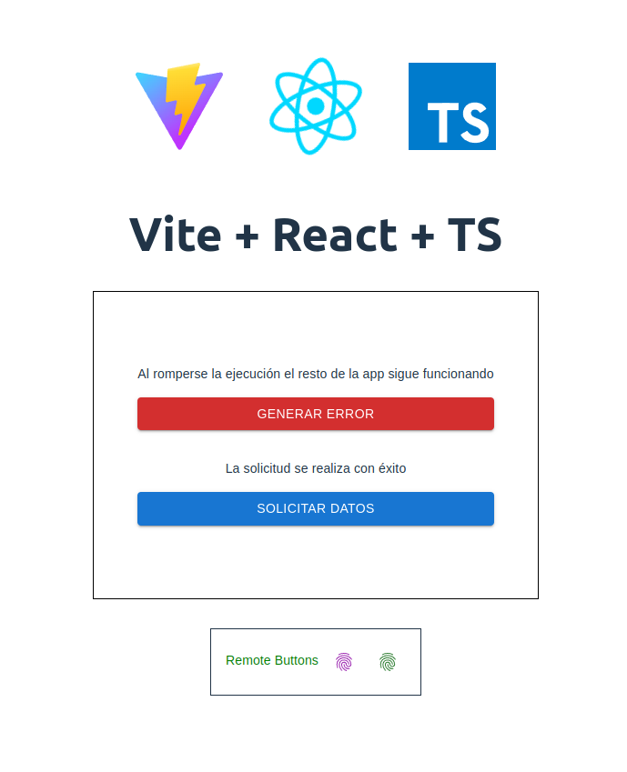
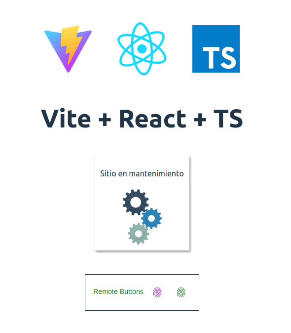

<h1 align="center" >
    Micro Frontend - Implementación de concepto
</h1>

    

 

  <a href="http://staging.smandes.gov.ar/gitea/Pruebas/vite-mf-react-ts/wiki">Lea más acerca de su implementación</a>

 

---

| Tecnología                       | Documentación                                                                  | Descripción                                                  |
| -------------------------------- | ------------------------------------------------------------------------------ | ------------------------------------------------------------ |
| React                            | https://react.dev                                                              | Interfaces de usuario                                        |
| Typescript                       | https://www.typescriptlang.org                                                 | Extiende JS - Tipado                                         |
| react-error-boundary             | https://github.com/bvaughn/react-error-boundary                                | Manejos de errores del ciclo de vida de componentes de React |
| Vite                             | https://vitejs.dev                                                             | Empaquetador de modulos                                      |
| @originjs/vite-plugin-federation | https://github.com/originjs/vite-plugin-federation#externalstringpromisestring | Plugin de Vite                                               |
| MUI Material UI                  | https://mui.com/                                                               | Biblioteca de Componentes                                    |

---

 

 Application

    

 

---

 

 Error de renderizado

    

---

    

        ¿Como funciona?
    

    

        La App host o root solamente contiene el encabezado de iconos y el titulo.  
        Los dos recuadros que vemos son modulos federados a travéz del plugin de Vite, por lo que nos permite importalos de manera remota y utilizalos de la manera tradicional como si de modulos locales se tratara.  
        De cualquier manera estamos pudiendo utilizar las caracteristicas de Lazy Suspense, las cuales son ofrecidas por el core de React, permitiendo realizar una carga perezosa de los componentes.  
        Por último hacemos uso de la libreria react-error-bundary que nos permite manejar los errores de render de una manera mas amigable con el usuario final. 
    

 

---
